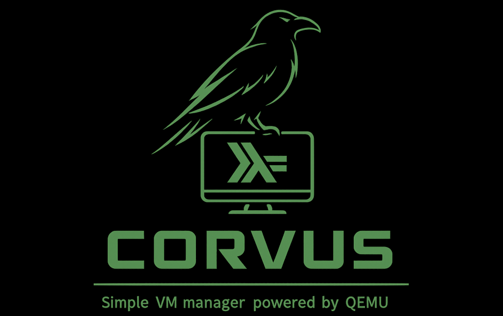

# Corvus

A lightweight QEMU/KVM virtual machine management daemon written in Haskell.

Corvus provides a daemon (`corvus`) that manages VM lifecycle and a CLI client (`crv`) for interacting with it. VMs are defined in a PostgreSQL database and executed via QEMU with KVM acceleration.

## Features

- **VM Lifecycle Management**: Start, stop, pause, and reset virtual machines
- **State Machine**: Enforces valid state transitions (stopped → running → paused, etc.)
- **Disk Image Management**: Create, resize, and attach qcow2/raw/vmdk/vdi disk images; import from local path or HTTP URL
- **Snapshot Support**: Create, rollback, merge, and delete qcow2 snapshots
- **Cloud-Init Integration**: Optional per-VM cloud-init with SSH key injection via NoCloud datasource; custom user-data and network-config per VM; lazy ISO generation on first SSH key attach or VM start
- **QEMU Guest Agent**: Execute commands in guests, periodic health checks and network address discovery via QGA protocol
- **SPICE Display**: Remote desktop access via SPICE protocol
- **Serial Console**: Buffered serial console for headless VMs with scrollback replay on reconnect
- **VM Templates**: Define VM blueprints in YAML and instantiate them easily
- **Declarative Apply**: Define entire environments (VMs, disks, networks, SSH keys) in a single YAML file with `crv apply`
- **Virtual Networks**: VDE-based virtual networks with automatic subnet allocation and dnsmasq DHCP/DNS
- **QMP Integration**: Graceful shutdown and pause via QEMU Machine Protocol
- **Shared Directories**: virtiofs support for sharing host directories with guests
- **Multiple Storage Types**: IDE, SATA, VirtIO, NVMe, and pflash drives
- **Networking**: VirtIO-net with user, bridge, TAP, and VDE support

## Installation

### Prerequisites

- GHC 9.x and Stack
- PostgreSQL
- QEMU with KVM support
- `qemu-img` (for disk image operations)
- `virtiofsd` (for shared directories)
- `genisoimage` or `mkisofs` (for cloud-init ISO generation)
- `vde_switch` and `dnsmasq` (optional, for virtual networking)
- `curl` or `wget` (optional, for HTTP disk image import)
- `remote-viewer` (optional, for `vm view` command)

### Building

```bash
make build
make install  # Installs to ~/.local/bin/ and sets up systemd user service
```

### Database Setup

```bash
createdb corvus
# The daemon runs migrations automatically on startup
```

## Usage

### Starting the Daemon

```bash
# Run with Unix socket (default: $XDG_RUNTIME_DIR/corvus/corvus.sock)
corvus --database postgresql://localhost/corvus

# Custom socket path
corvus --socket /tmp/corvus.sock --database postgresql://localhost/corvus

# Run with TCP instead
corvus --tcp --host 127.0.0.1 --port 9876 --database postgresql://localhost/corvus

# Or install and start as a user service
make install
```

### Client Commands

#### Daemon Commands

```bash
crv ping             # Ping the daemon
crv status           # Get daemon status (uptime, running VMs)
crv shutdown         # Request daemon shutdown
```

#### VM Commands

```bash
crv vm list                       # List all VMs (includes CI column)
crv vm show <id>                  # Show VM details (drives, network, sockets)
crv vm create <name> <cpus> <ram> # Create a VM (--cloud-init, --guest-agent, --headless)
crv vm edit <id>                  # Edit VM settings (--cloud-init, --guest-agent, etc.)
crv vm start <id>                 # Start a stopped/paused VM
crv vm stop <id>                  # Graceful shutdown (via QMP or guest agent)
crv vm pause <id>                 # Pause execution
crv vm reset <id>                 # Force stop (SIGKILL)
crv vm view <id>                  # Open SPICE viewer or serial console (headless)
crv vm monitor <id>               # Connect to HMP monitor (Ctrl+] to exit)
```

#### Disk Commands

```bash
# Create a new disk image
crv disk create <name> --size <size> [--format <format>]
crv disk create myvm-boot --size 20G --format qcow2
crv disk create data-disk --size 100G -f raw

# Import an existing disk image (local path or HTTP URL)
crv disk import <name> <path-or-url> [--format <format>]
crv disk import debian-base ~/VMs/debian.qcow2
crv disk import windows-iso /data/isos/windows.iso -f raw
crv disk import alpine-cloud https://example.com/alpine-virt.qcow2

# Manage disk images
crv disk list                    # List all disk images
crv disk show <disk_id>          # Show disk details
crv disk delete <disk_id>        # Delete a disk image
crv disk resize <disk_id> -s <size>  # Resize disk (VM must be stopped)

# Attach/detach disks to VMs
crv disk attach <vm_id> <disk_id> [-i <interface>] [-m <media>]
crv disk attach 1 2 --interface virtio
crv disk attach 1 3 -i ide -m cdrom
crv disk detach <vm_id> <drive_id>
```

Supported formats: `qcow2`, `raw`, `vmdk`, `vdi` (auto-detected from extension)
Supported interfaces: `virtio`, `ide`, `scsi`, `sata`, `nvme`
Supported media: `disk`, `cdrom`

Note: When importing, if the disk is located in the base images directory (`$HOME/VMs`), a relative path is stored for portability.

#### Snapshot Commands

Snapshots are supported for qcow2 disk images only. VM must be stopped for rollback/merge operations.

```bash
crv snapshot create <disk_id> <name>      # Create a snapshot
crv snapshot list <disk_id>               # List snapshots for a disk
crv snapshot rollback <disk_id> <snap_id> # Rollback to a snapshot
crv snapshot merge <disk_id> <snap_id>    # Merge snapshot into base
crv snapshot delete <disk_id> <snap_id>   # Delete a snapshot
```

#### SSH Key Commands

SSH keys can be attached to VMs that have cloud-init enabled. The cloud-init ISO is generated lazily when the first key is attached or when the VM starts.

```bash
# Manage SSH keys
crv ssh-key create <name> "<public_key>"  # Create a new SSH key
crv ssh-key list                          # List all SSH keys
crv ssh-key delete <key_id>               # Delete an SSH key

# Attach/detach keys to VMs (requires cloud-init enabled on the VM)
crv ssh-key attach <vm_id> <key_id>       # Attach key to VM (generates cloud-init ISO)
crv ssh-key detach <vm_id> <key_id>       # Detach key from VM
crv ssh-key list-vm <vm_id>               # List keys attached to a VM
```

#### Cloud-Init Commands

Manage per-VM cloud-init configuration. By default, cloud-init generates a standard config with user `corvus`, SSH key injection, and `qemu-guest-agent`. Custom configs allow different users, packages, and commands per VM/OS.

```bash
# Generate/regenerate cloud-init ISO
crv cloud-init generate <vm_id>

# Set custom cloud-init config from files
crv cloud-init set <vm_id> --user-data <file>              # Custom user-data
crv cloud-init set <vm_id> --network-config <file>         # Custom network-config
crv cloud-init set <vm_id> --user-data <file> --no-inject-ssh-keys  # No SSH key injection

# Show current cloud-init config
crv cloud-init show <vm_id>

# Delete custom config (revert to defaults)
crv cloud-init delete <vm_id>
```

When `--no-inject-ssh-keys` is omitted (default), SSH keys from the database are automatically merged into the first user's `ssh_authorized_keys` in the custom config. The `#cloud-config` header is managed by Corvus — do not include it in your files.

#### Guest Agent Commands

Execute commands inside running VMs via the QEMU Guest Agent (requires `guest-agent` enabled on the VM and qemu-ga running in the guest).

```bash
crv guest-exec <vm_id> <command> [args...]   # Run command in VM
crv guest-exec 1 whoami                      # Example: check user
crv guest-exec 1 cat /etc/hostname           # Example: read file
```

#### Serial Console

Headless VMs (`--headless`) use a serial console instead of SPICE. The daemon maintains a 1 MB ring buffer per headless VM, so reconnecting shows recent output (boot messages, login prompts, etc.) instead of a blank screen.

```bash
crv vm view <id>                  # Connects to serial console for headless VMs
```

The serial console uses raw terminal mode. An escape prefix (`Ctrl+]`) provides special commands:

| Sequence | Action |
|----------|--------|
| `Ctrl+]` `q` | Quit the console session |
| `Ctrl+]` `d` | Send Ctrl+Alt+Del to the VM |
| `Ctrl+]` `f` | Flush (clear) the serial console ring buffer |
| `Ctrl+]` `Ctrl+]` | Send a literal `Ctrl+]` to the VM |
| `Ctrl+]` `?` | Show help |

The ring buffer captures all serial output while the VM is running, regardless of whether a client is connected. On reconnect, the buffer contents are replayed so you see what happened while disconnected. The buffer persists across guest reboots (the QEMU process stays alive) and is automatically cleaned up when the VM stops.

To use the serial console, the guest OS must be configured to output to the serial port. For Linux guests, add `console=ttyS0,115200n8` to the kernel command line and enable a serial getty (e.g. `systemctl enable serial-getty@ttyS0`). UEFI firmware menus also work over serial when no VGA device is present.

#### Network Commands

Manage virtual networks (bridge-based with dnsmasq for DHCP/DNS, running inside the daemon's unprivileged network namespace).

```bash
crv network create <name>                       # Create a virtual network
crv network create <name> --subnet 10.0.1.0/24  # With subnet
crv network create <name> --subnet 10.0.1.0/24 --dhcp  # With DHCP
crv network create <name> --subnet 10.0.1.0/24 --dhcp --nat  # With DHCP + NAT
crv network start <id>            # Start the network (creates bridge, dnsmasq)
crv network stop <id>             # Stop the network
crv network list                  # List all networks
crv network show <id>             # Show network details
crv network delete <id>           # Delete a network
```

#### Network Interface Commands

Add and remove network interfaces on VMs. Each interface gets a VirtIO NIC with an auto-generated MAC address (or specify one with `--mac`).

```bash
# List/remove interfaces
crv net-if list <vm_id>                    # List VM's network interfaces
crv net-if remove <vm_id> <netif_id>       # Remove a network interface

# User-mode networking (default, built-in NAT, no setup required)
crv net-if add <vm_id> --type user
crv net-if add <vm_id> -t user -d "hostfwd=tcp::2222-:22"                     # SSH forwarding
crv net-if add <vm_id> -t user -d "hostfwd=tcp::2222-:22,hostfwd=tcp::8080-:80"  # Multi-port

# Managed virtual network (daemon creates bridge + TAP in namespace)
crv net-if add <vm_id> --network my-net

# TAP device (pre-configured on host)
crv net-if add <vm_id> --type tap --host-device tap0

# Bridge (pre-configured on host)
crv net-if add <vm_id> --type bridge --host-device br0

# VDE virtual switch (external vde_switch)
crv net-if add <vm_id> --type vde --host-device /var/run/vde.ctl

# Explicit MAC address
crv net-if add <vm_id> --type user --mac 52:54:00:12:34:56
```

**Interface types:**

| Type | Description | `--host-device` |
|------|-------------|-----------------|
| `user` | QEMU user-mode networking with built-in NAT | Optional: QEMU netdev options (e.g. `hostfwd=...`) |
| `managed` | Daemon-managed bridge/TAP in network namespace | Auto (set via `--network`) |
| `tap` | Pre-configured TAP device on host | Required: TAP device name |
| `bridge` | Pre-configured bridge on host | Required: bridge name |
| `vde` | External VDE virtual switch | Required: VDE socket path |
| `macvtap` | MACVTAP device | N/A (uses fd passing) |

**Port forwarding** (user mode only): `hostfwd=<proto>::<host_port>-:<guest_port>`, e.g. `hostfwd=tcp::2222-:22` forwards host port 2222 to guest SSH. Multiple rules are comma-separated.

#### Template Commands

VM templates allow you to define a complete VM configuration (CPU, RAM, disks, network, SSH keys) in a YAML file and instantiate it as many times as needed.

```bash
# Manage templates
crv template create <file.yaml>           # Create a template from YAML
crv template list                        # List all templates
crv template show <template_id>          # Show template details
crv template delete <template_id>        # Delete a template

# Instantiate a VM from a template
crv template instantiate <template_id> <new_name>
```

##### Template YAML Example

```yaml
name: "ubuntu-22.04-webserver"
description: "Standard web server template with 20GB root disk"
cpuCount: 2
ramMb: 2048
cloudInit: true            # Enable cloud-init (required for sshKeys)
cloudInitConfig:           # Optional: custom cloud-init config
  userData:                # Parsed as YAML, #cloud-config header added by Corvus
    users:
      - name: deploy
        sudo: "ALL=(ALL) NOPASSWD:ALL"
    packages:
      - nginx
      - certbot
    runcmd:
      - systemctl enable nginx
  networkConfig:           # Optional: network-config for static IPs etc.
    version: 2
    ethernets:
      eth0:
        dhcp4: true
  injectSshKeys: true      # Default: true (merge DB SSH keys into first user)
drives:
  - diskImageName: "ubuntu-22.04-base"
    interface: "virtio"
    strategy: "overlay"    # options: clone, overlay, direct
    newSizeMb: 20480       # resize disk after instantiation
networkInterfaces:
  - type: "user"           # options: user, bridge, tap, vde
sshKeys:
  - name: "admin-key"
```

#### Apply Command

Define entire environments declaratively in YAML and create them with a single command. Supports SSH keys, disk images (local or HTTP), virtual networks, and VMs with drives, network interfaces, and shared directories.
See `apply-configuration.md` for complete documentation and  `apply-examples/` for examples.

```bash
crv apply <file.yaml>              # Create all resources from YAML
crv apply my-environment.yml       # Example
```

Cloud-init is auto-enabled on VMs that reference SSH keys. VMs can include a `cloudInitConfig` section with custom `userData`, `networkConfig`, and `injectSshKeys` settings. See `doc/apply-examples/` for complete examples.

### Connection Options

```bash
# Unix socket (default: $XDG_RUNTIME_DIR/corvus/corvus.sock)
crv vm list

# Custom socket path
crv --socket /tmp/corvus.sock vm list

# TCP connection
crv --tcp --host 127.0.0.1 --port 9876 vm list
```

### Shell Completion

`crv` supports generating shell completion scripts via `optparse-applicative`. Completions are derived directly from the parser definitions, so they always reflect the current set of commands and options.

```bash
# Zsh — generate and install completion
crv --zsh-completion-script $(which crv) > ~/.local/share/zsh/site-functions/_crv

# Bash
crv --bash-completion-script $(which crv) > ~/.local/share/bash-completion/completions/crv

# Fish
crv --fish-completion-script $(which crv) > ~/.config/fish/completions/crv.fish
```

For a quick one-off test without installing:

```bash
source <(crv --zsh-completion-script $(which crv))
```

## Development

### Building and Testing

```bash
# Build
make build

# Run tests
make all-tests  # Run all tests
make unit-tests  # Run unit tests
make integration-tests  # Run integration tests
make test MATCH="/Corvus.VmIntegration"  # Run integration tests for a specific test suite 
make integration-tests JOBS=1  # Run integration tests sequentially. Slower but more reliable.

# Run daemon locally
stack exec corvus -- -d postgresql://localhost/corvus_test --log-level debug

# Run client
stack exec crv -- vm list
```

### Code Quality

```bash
# Linting
make lint

# Formatting
make format
```

## Architecture

### Communication Protocol

Client and daemon communicate over TCP or Unix socket using a simple binary protocol:

1. **Length prefix**: 8-byte big-endian integer
2. **Payload**: Binary-encoded request/response

Messages are serialized using GHC's `Data.Binary` with auto-derived instances.

### Process Management

When a VM starts:
1. Status set to `running` in database
2. virtiofsd processes started for shared directories (if any)
3. QEMU spawned in a background thread (non-daemonized)
4. PID saved to database
5. Background thread waits for process exit
6. On exit: status updated to `stopped` (success) or `error` (failure)

Graceful shutdown uses QMP `system_powerdown`. Force stop uses `SIGKILL`.

### Runtime Files

Sockets and runtime files are stored in `$XDG_RUNTIME_DIR/corvus/<vm_id>/`:
- `monitor.sock` - HMP monitor socket
- `qmp.sock` - QMP control socket
- `spice.sock` - SPICE display socket
- `serial.sock` - Serial console socket (headless VMs)
- `qga.sock` - QEMU Guest Agent socket
- `virtiofsd-<tag>.sock` - virtiofsd sockets

## Limitations

- **Single Host Only**: No clustering or migration support
- **No Live Migration**: VMs cannot be migrated between hosts
- **No Live Snapshots**: Snapshots require VM to be stopped (qcow2 internal snapshots supported)
- **No Resource Limits**: No CPU/memory cgroup controls
- **No VNC**: Only SPICE display is supported
- **No Authentication**: Client-daemon communication is unauthenticated
- **No TLS**: TCP communication is unencrypted (use Unix socket or SSH tunnel)
- **Linux Only**: Relies on KVM, Unix sockets, and POSIX signals

## License

BSD-3-Clause

